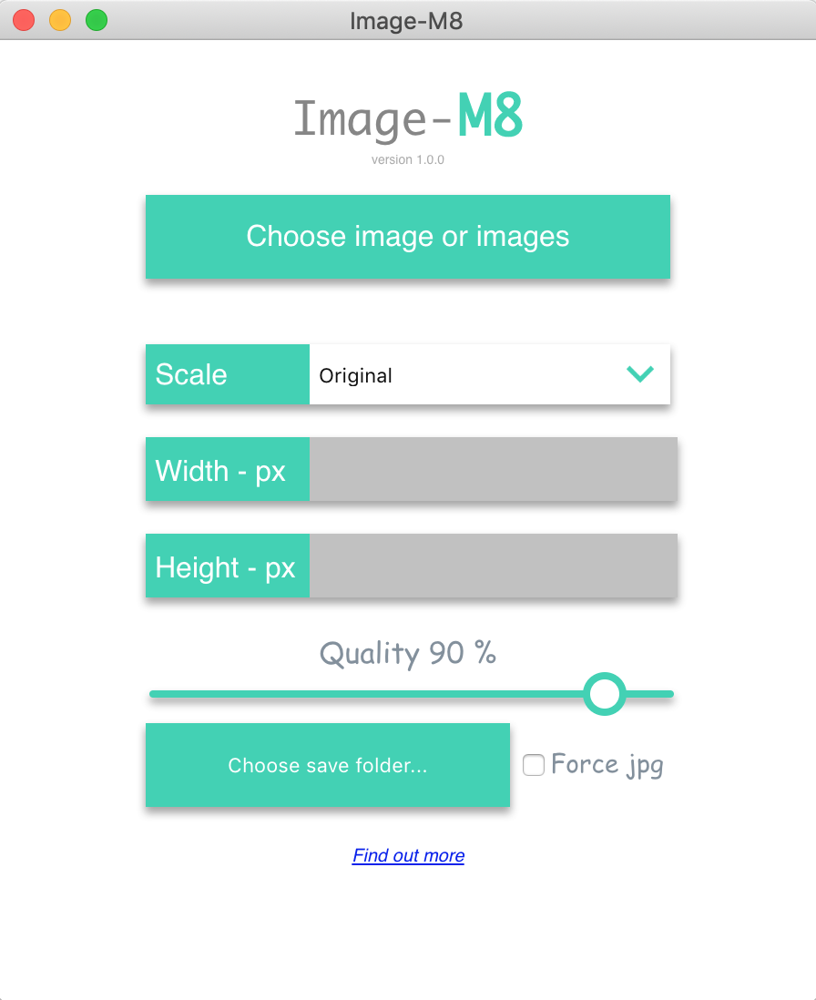

<div style="text-align:center">
<p>image-M8</p>

</div>

# What is it ?

 **Image-M8** is a **cross**-**platform** tool to help with image compression and image resizing. It is built with  **Electron** and **Vanila JavaScript** it does't use any third party library's or frameworks except of course **Electron**.
 
 Website:[chek out here](https://image-m8.com)
 
# Usage

Download the release from this repository for your platform (read instructions provided at the release note). 

- **simple compression** - Choose an image or multiple images by clicking on "choose image or images" button, choose your images you want to compress. The output will be in the same folder where you have chosen your images and will have an extension _imagem8
- **Scale by width or height** - Choose from dropdown how you want the scaleFactor to behave if you choose width, the tool automatically calculates the height so that the aspect ratio is contained
- **Quality Slider** - The Quality slider can be used to change the quality of the image, For .png images, it is used to resize accordingly
- **Choose save folder** - Allows you to store the resized/compressed images in separate folder, they will retain the same name
- **Force Jpg** - This option forces images to be compressed to JPG format


## Development
Clone repository and run with 
```bash
$ gulp
```
There is a small script that watches for your changes and restarts the app

## Contribute
New features, bug fixes and improvements are welcome! For questions and suggestions use the  [issues](https://github.com/nikolaDrangovski/imageM8/issues)